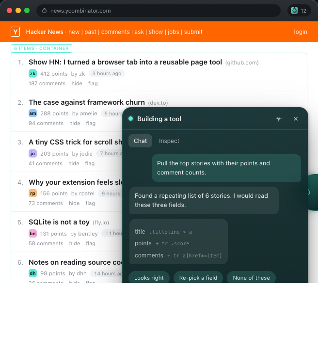
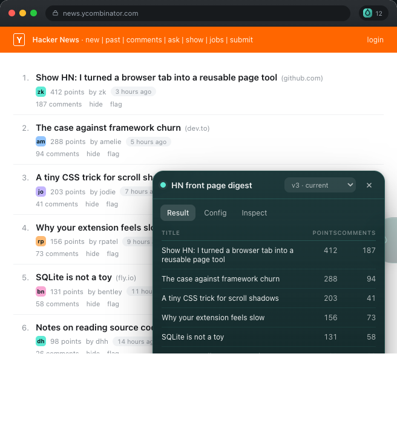
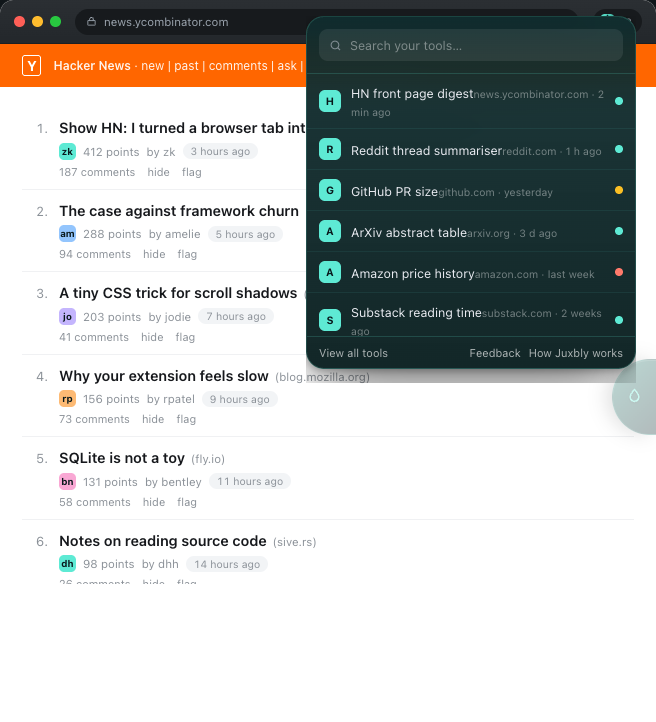

# Juxbly

**The instant browser app factory.** Describe what you want on the page you are looking at: you get the result right away, and the tool that produced it stays behind — it comes back by itself next time you visit.

> Status: **pre-implementation**. The MV3 skeleton loads in Chrome and the DSL with its validation layer is in place; page analysis, tools, panels and highlight confirmation are not built yet. For what V1 deliberately will not do, see [`docs/contributing/SCOPE.md`](docs/contributing/SCOPE.md).

<p align="center">
  
  
  
</p>
<p align="center"><sub>Prototype UI: describe a need &rarr; confirm the highlighted fields &rarr; get the result &rarr; the tool stays and comes back by itself.</sub></p>

---

## 1. What it is

Juxbly is an open-source Chrome extension (Manifest V3). You describe a need in natural language on the current page. A model analyses the page and produces a **Tool DSL** configuration. You confirm it once through an on-page highlight, and the tool is **saved**. From then on, whenever you visit a matching page, the tool appears and runs by itself.

The unit of value is the **Tool**, not the prompt:

```
Discover → Build → Confirm → Save → Run → Deliver → Health → Repair → Version → Reuse
```

## 2. Why it exists

Most one-off web tasks — "pull the price column out of this table", "collect every result card on this search page", "summarise the reviews on this product page" — are too small to write a script for and too specific for an existing extension.

Juxbly's bet is not "run this task once". It is:

> **Turn a one-off long-tail need into a result you can take away — and a persistent page tool you keep.**

The result comes first: every run lands the data in front of you with copy / CSV / JSON one click away. The tool stays as a by-product and is attributed on the result itself, so you always know what produced it — and that it will be there next time.

That means the hard parts are not only generation, but also **failure visibility, low-cost repair, and versioning**. Juxbly does not promise a tool never breaks; it promises a broken tool is detected, explained, and cheap to rebuild.

## 3. Who it is for

- Developers and power users who hit repeating, page-specific information tasks.
- Researchers and knowledge workers who process web pages in bulk.
- Contributors who care about LLM + DOM understanding, prompt-injection defence, and local-first browser tooling.

Juxbly is **not** a generic chat sidebar, **not** a universal scraper, and **not** an "AI writes and runs JavaScript" engine. See [`docs/contributing/SCOPE.md`](docs/contributing/SCOPE.md) for the explicit boundaries.

### Where it works, and where it struggles

Measured on a ten-site sample before implementation:

| Page shape | Status |
|---|---|
| Regular, well-structured pages and documents | Reliable — this is what V1 targets |
| Infinite scroll | Best effort |
| Client-rendered SPA | Best effort |
| Hashed or generated class names | Best effort |

Best effort means it may work and may not. When it does not, Juxbly says so instead of showing an empty result — and nothing here claims it works on every website.

## 4. How it works

```
Tool DSL (LLM produces configuration, never code)
   ↓
Capability Runtime (extract / transform / llm / render / export)
   ↓
Browser Adapter (the only place allowed to touch chrome.*)
   ↓
Browser APIs
```

- **Code is fixed, configuration is variable.** The model emits JSON; a whitelist interpreter executes it. There is no `eval`, no `new Function`, no remote code loading anywhere in the repository.
- **Deterministic work never calls the model.** `extract` / `transform` / `render` are local; only `llm` steps cost tokens, and they are skipped when inputs have not changed.
- **Bring your own key.** Any **OpenAI-compatible endpoint** works — OpenAI, OpenRouter, Together, or a local gateway (LM Studio, Ollama's OpenAI-compatible server, …) — set the base URL once. Page content goes from your browser, through your own API key, to the endpoint you chose. There is no Juxbly server in the path and no telemetry.

Details: [`docs/ARCHITECTURE.md`](docs/ARCHITECTURE.md).

## 5. Install (from source)

```bash
git clone https://github.com/liang-index/juxbly.git
cd juxbly
pnpm install
pnpm dev            # builds to .output/chrome-mv3 with watch
```

Then in Chrome:

1. Open `chrome://extensions`.
2. Enable **Developer mode**.
3. **Load unpacked** → select `.output/chrome-mv3`.

First run: click the floating ball on any page and describe what you want. Juxbly asks for an API key only at the moment it truly needs to call a model.

> The skeleton loads and the popup opens, but nothing is wired yet: page analysis, tools, panels and highlight confirmation are still to come.

## 6. Local development

| Command | Purpose |
|---|---|
| `pnpm install` | install workspace dependencies |
| `pnpm dev` | build the extension in watch mode |
| `pnpm build` | production build |
| `pnpm typecheck` | `tsc --noEmit` across all packages |
| `pnpm lint` | ESLint |
| `pnpm test` | Vitest unit + integration |
| `pnpm test:bench` | local web benchmark (Phase 2+) |

Full setup, debugging, and troubleshooting: [`docs/DEVELOPMENT.md`](docs/DEVELOPMENT.md).

## 7. Testing

```bash
pnpm test                 # unit (tests/unit) + integration (tests/integration)
pnpm test -- --watch      # watch mode
pnpm test:bench           # Web Corpus + Task Corpus (Phase 2)
```

Integration tests run the real runtime against fixture HTML with a mock `BrowserAdapter` and a mock `LlmPort` — no Chrome, no network, no API key required. Test scope and the regression trigger rule: [`docs/testing/TESTING.md`](docs/testing/TESTING.md).

## 8. Where to start reading

| I want to… | Start here |
|---|---|
| understand the system and type contracts | [`docs/ARCHITECTURE.md`](docs/ARCHITECTURE.md) |
| know what a module owns | [`docs/CODE_MAP.md`](docs/CODE_MAP.md) |
| read the DSL | `packages/dsl` + [`docs/ARCHITECTURE.md` §5](docs/ARCHITECTURE.md) |
| add a capability | [`docs/contributing/CAPABILITY_GUIDE.md`](docs/contributing/CAPABILITY_GUIDE.md) |
| read the design tokens | [`docs/UI_SPEC.md`](docs/UI_SPEC.md) |
| know what V1 will not do | [`docs/contributing/SCOPE.md`](docs/contributing/SCOPE.md) |

Two goals drive this layout: **Developer Time to First Success** and **Developer Time to First Contribution**.

## 9. Contributing

Low-friction paths first: documentation, tests, **benchmark cases**, **recipes**, then bug fixes, then small capabilities. Core architecture, DSL, permissions and security boundaries are maintainer-controlled.

Start with [`CONTRIBUTING.md`](CONTRIBUTING.md), then the guide that matches your contribution:

- Capability → [`docs/contributing/CAPABILITY_GUIDE.md`](docs/contributing/CAPABILITY_GUIDE.md)
- Recipe → [`docs/contributing/RECIPE_GUIDE.md`](docs/contributing/RECIPE_GUIDE.md)
- Benchmark case → [`docs/contributing/BENCHMARK_GUIDE.md`](docs/contributing/BENCHMARK_GUIDE.md)

## 10. Privacy and security

- All data stays in `chrome.storage.local`. No sync, no account, no telemetry — this is a permanent position for the Open Source Build, not a temporary state.
- Your API key is read **only** in the background service worker and never enters the content script, the page context, or logs.
- Page content is untrusted input. Model prompts wrap it as *data*, never as instructions.
- Reporting a vulnerability: [`SECURITY.md`](SECURITY.md). Data handling statement: [`PRIVACY.md`](PRIVACY.md).

## 11. Docs index

| Document | Role |
|---|---|
| [`docs/ARCHITECTURE.md`](docs/ARCHITECTURE.md) | type contracts and module interfaces |
| [`docs/UI_SPEC.md`](docs/UI_SPEC.md) | design tokens and component behaviour rules |
| [`docs/CONVENTIONS.md`](docs/CONVENTIONS.md) | engineering conventions and the regression rule |
| [`docs/CODE_MAP.md`](docs/CODE_MAP.md) | module → responsibility → where to look |
| [`docs/DEVELOPMENT.md`](docs/DEVELOPMENT.md) | getting started for developers |
| [`docs/contributing/SCOPE.md`](docs/contributing/SCOPE.md) | what V1 deliberately does not do |
| [`docs/contributing/CAPABILITY_GUIDE.md`](docs/contributing/CAPABILITY_GUIDE.md) | how to write a capability |
| [`docs/contributing/RECIPE_GUIDE.md`](docs/contributing/RECIPE_GUIDE.md) | how to publish a recipe |
| [`docs/contributing/BENCHMARK_GUIDE.md`](docs/contributing/BENCHMARK_GUIDE.md) | how the Web Corpus benchmark works |
| [`docs/testing/TESTING.md`](docs/testing/TESTING.md) | test layers and the regression trigger rule |
| [`docs/contributing/DOC_CHANGE_PROTOCOL.md`](docs/contributing/DOC_CHANGE_PROTOCOL.md) | how to change a shared contract |

Each fact has exactly one authoritative source; other documents only reference it ([`docs/contributing/DOC_CHANGE_PROTOCOL.md`](docs/contributing/DOC_CHANGE_PROTOCOL.md)).

## 12. License

Code is licensed under **AGPL-3.0** — see [`LICENSE`](LICENSE).

The **Juxbly name, logo, official domain and official Chrome Web Store identity are not covered by the code license** and are governed separately by the brand policy in [`TRADEMARK.md`](TRADEMARK.md).
